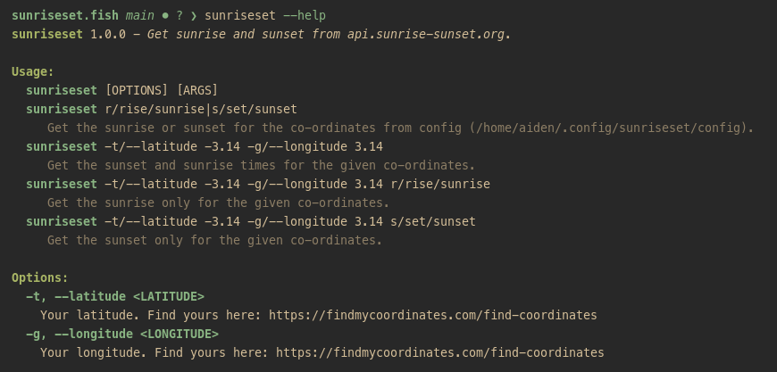

# sunriseset.fish

[](https://builds.sr.ht/~nedia?)
[](https://github.com/aidenlangley/sunriseset.fish/actions/workflows/ci.yml)

Gets your sunrise and sunset times from `api.sunrise-sunset.org`. You can either
pass your latitude and longitude to the function, or set it permanently in
config (`$XDG_CONFIG_HOME/sunriseset/config`).



## Install

via [fisher](https://github.com/jorgebucaran/fisher):

```fish
fisher install aidenlangley/sunriseset.fish
```

## Config

Config is dead simple. You can [find your GPS coordinate here](https://findmycoordinates.com/find-coordinates).
Just put latitude first, and longitude second, like so:

```txt
# $XDG_CONFIG_HOME/sunriseset/config
-36.9658
174.8363
```

## Usage

```sh
# Get the sunrise or sunset for the co-ordinates from config ($XDG_CONFIG_HOME/sunriseset/config).
sunriseset r/rise/sunrise|s/set/sunset

# Get the sunset and sunrise times for the given co-ordinates.
sunriseset -t/--latitude -3.14 -g/--longitude 3.14

# Get the sunrise only for the given co-ordinates.
sunriseset -t/--latitude -3.14 -g/--longitude 3.14 r/rise/sunrise

# Get the sunset only for the given co-ordinates.
sunriseset -t/--latitude -3.14 -g/--longitude 3.14 s/set/sunset
```

I use this to automatically update my `hyprsunset` config like so:

```sh
#! /usr/bin/env bash

sunrise=$(fish -c 'sunriseset sunrise')
sunset=$(fish -c 'sunriseset sunset')

path="$XDG_CONFIG_HOME"/hypr/hyprsunset.conf
fish -c "backup --verbose --suffix='.bak' $path"

cat >"$path" <<EOF
# Auto generated by update-hyprsunset
profile {
  time = $sunrise
  identity = true
}

profile {
  time = $sunset
  temperature = 4500
  gamma = 0.8
}
EOF

fish -c "log --level OK 'Update complete { sunrise: $sunrise, sunset: $sunset }'"
```

Runs at the same time as `hyprsunset` via systemd service.

```systemd
[Unit]
Description=A script to update hyprsunset config with location based sunrise and sunset.
Documentation=https://git.sr.ht/~nedia/update-hyprsunset
PartOf=graphical-session.target
Requires=graphical-session.target
After=graphical-session.target
ConditionEnvironment=WAYLAND_DISPLAY

[Service]
Type=simple
ExecStart=%h/.local/bin/update-hyprsunset
Slice=session.slice
Restart=on-failure

[Install]
WantedBy=graphical-session.target
```
